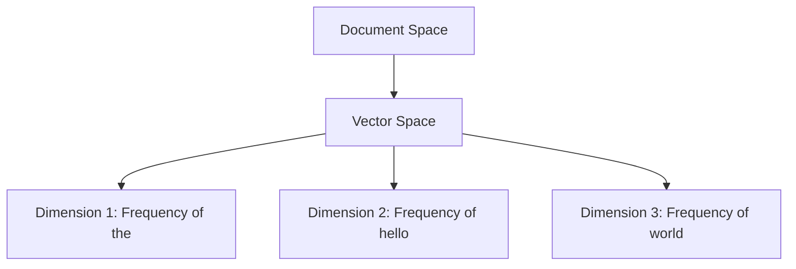
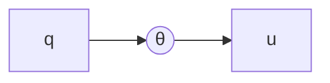
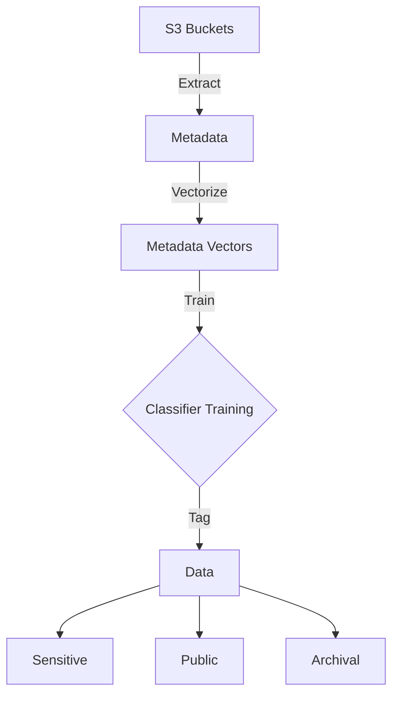

## Foundations of Vector Retrieval


Vector retrieval is the process of identifying the top k vectors that are closest to a query vector from a large collection of vectors. This is a significant problem in areas such as search engines, recommender systems, and question answering.

## Vector Representations

Objects from the real world like documents, images, and videos can be represented as vectors in a d-dimensional space, denoted as R^d. Each dimension in this space represents a feature of the object, and the value in each dimension signifies the strength or presence of that feature.

For instance, consider a text document represented as a vector. Each dimension of this vector corresponds to a unique word, with the value in each dimension indicating the frequency of that word's occurrence in the document.



This form of representation allows us to capture the semantics of the document and facilitates mathematical operations like measuring the distance between two document vectors, which helps quantify their semantic similarity.

## Vector Retrieval Problem

The vector retrieval problem is defined as follows:

- Given a collection of N vectors X = {x1, x2, ..., xN} in R^d
- A distance function Δ(u, v) to measure the distance between two vectors u and v
- A query vector q in R^d

The goal is to find the top k vectors in X that are closest to the query vector q, as determined by the distance function Δ.

This is achieved by solving:
argmin_(u in X) Δ(q, u)_{(k)}

Here, (k) indicates the selection of the k vectors from X that have the smallest distances from q. For example, for k=3, we aim to find 3 vectors from X that are closest to q.

The goal is to find the top k vectors in the collection X that have the smallest distance to the query vector q, according to the distance function Δ(·,·).

This is mathematically formulated as:

```
argmin_{u in X} Δ(q, u)_{(k)}
```

To break this down:

- `argmin` refers to finding the vectors that minimize the objective function. Here we wish to minimize the distance function Δ(q, u).

- `u in X` indicates u is taken from the collection of vectors X. So we are minimizing over all vectors in X.

- `Δ(q, u)` measures the distance between the query vector q and a vector u from X.

- The subscript `(k)` indicates that we want the k vectors that give the smallest values for Δ(q, u).

For example, if k=5, we want to find the 5 vectors in X that have the smallest distances from q, according to Δ.

So in words, this is finding the k vectors in X that minimize the distance function between themselves and the query vector q. The argmin notation provides a precise mathematical formulation to state this objective.

## Distance Functions

Several distance functions Δ are commonly used, including:

- **Euclidean Distance:** This measures the L2 distance between two vectors as ||u - v||_2 = (∑_(i=1)^(d) (u_i - v_i)^2)^(1/2). Minimizing this squared distance is the basis of the k-Nearest Neighbors (kNN) problem.

- **Angular Distance:** This measures the angle between two vectors. Represented as:



Δ(u, v) = 1 - <u,v>/(||u||_2 ||v||_2) = 1 - cos θ. Maximizing the cosine similarity is the objective in the Maximum Cosine Similarity Search problem.

- **Inner Product Distance:** Uses the inner product, Δ(u, v) = -<u, v>, and is the basis of the Maximum Inner Product Search (MIPS) problem.

## Exact vs. Approximate Retrieval

Solving the vector retrieval problem exactly and efficiently in high-dimensional spaces is computationally difficult. Therefore, we face a choice: either accept an inefficient solution in terms of space or time complexity or allow some error.

Exact solutions, while precise, are often impractical. This leads to ε-approximate vector retrieval problems, where the solution is satisfactory if the distance of the vector u returned by the algorithm is at most (1 + ε) times larger than the optimal vector u*, according to Δ(·,·), for some small value of ε > 0:

Δ(q, u) ≤ (1 + ε)Δ(q, u*)

Here, u* represents the optimal vector found by solving the exact problem.


Here are some additional details on exact versus approximate vector retrieval:

**Exact Vector Retrieval**
- Finds the vectors in collection X that precisely minimize the distance function Δ(q, u) for a query vector q
- Returns optimal result, but has downsides:
    - Often has high time complexity (needs to evaluate Δ(q, u) for all vectors u)
    - Has high space complexity (needs to index all vectors without compression)
- Becomes inefficient for large vector collections X or high dimensions d

**Approximate Vector Retrieval**
- Allows some error in results to gain efficiency
- Returns a vector u where:
    - Δ(q, u) ≤ (1 + ε)Δ(q, u*)
    - u* is optimal vector from exact retrieval
    - ε is error tolerance parameter
- Benefits:
    - Can use algorithms with better time/space complexity
    - Allows compression of vector index
    - Runs efficiently even for large X or high d
- Downside:
    - Result not guaranteed to be optimal

Controlling the value of ε allows trading off between accuracy and efficiency. A small ε prioritizes precision, while larger values prioritize faster queries.

So approximate retrieval relaxes the constraints of finding the optimally closest vectors to q, in order to enable faster searches over larger datasets.

## Classification of Data on S3 using S3 Metadata Vectors

We can leverage S3 object metadata to classify and tag data for security and compliance purposes.

The metadata of objects stored in an S3 bucket provides semantic signals on the type of data. This includes attributes like:

Input Vector (S3 Metadata) | Description 
---|---
Bucket Name | The S3 bucket storing the object
Object Key | The full path locating the object within the bucket 
Size | Storage consumed by the object  
Last Modified Date | Timestamp when object was last updated

By representing this metadata for S3 objects as vectors in R^d, we can model similarities between data based on their attributes.

The distance Δ(u, v) between metadata vectors u and v captures how related two S3 objects are. Smaller distances imply greater similarity.

We can train a classifier on top of these metadata vectors to categorize data:

```
Input Vector: 
   S3 Metadata Vector x
   
Output Vector   
   f(x) -> (P(y='Sensitive'| x), 
           P(y='Public'| x),
           P(y='Archival'| x))
```

The model f(x) outputs a vector of probabilities over different classes it has learned during training. Predicting the most likely class for a new unseen piece of data stored on S3 is then straightforward using its vector representation.

Some examples of useful security classes are:

- Sensitive Data
- Public Data
- Archival Data

Attaching semantic tags based on these categories allows managing data in a centralized, flexible manner. The classifier can be retrained to update the tagging scheme.

This vector representation of S3 metadata provides a data-centric abstraction that lends itself well to machine learning algorithms. Similar data instances have similar vector profiles, enabling generalization of categories across S3.

Here is a diagram showing the flow of classifying S3 data using metadata vectors:



The process involves:

1. Extracting metadata like bucket names, object keys, size, timestamps from S3 buckets

2. Representing this metadata for each S3 object as a vector x in R^d

3. Training a classification model f(x) that outputs probability scores P(y|x) over different classes y like `Sensitive`, `Public`, `Archival`

4. Using the vector classifier to tag data objects with the most likely class

5. Attach appropriate security controls like encryption, access roles, expiration rules based on the predicted tags

The key benefit is that by representing S3 metadata attributes as vectors, we can exploit similarities between data to classify and manage them. The distance Δ(u, v) between vectors u and v indicates their semantic affinity.

Groupings learned by the classifier over these vectors allows centralized and automated data governance on the cloud.

**_Example_**

Vectors are mathematical representations that capture attributes of interest as dimensions. Similarity between vectors can model affinity between real-world entities. We can encode S3 metadata like bucket names, object paths, sizes, timestamps as dimensions of a vector x in R^d. The distance function Δ(u,v) measures closeness between any two metadata vectors u and v.

Smaller Δ(u,v) implies greater similarity. This allows grouping alike S3 objects via metadata vectors, even if the buckets are dispersed or paths randomized. For example, financial reports scattered across S3 with large sizes may form one cluster. Clickstream logs with recent timestamps could be another cluster.

A classifier uses these inherent similarities to generalize labels across unstructured cloud data. Training it to map metadata vectors with tagged examples allows centralized and automated data governance.

**Input**

| Bucket Name | Object Key | Size (GB) | Last Modified |
|-------------|------------|-----------|---------------| 
| financial-data | reports/2023/january.pdf | 0.2 | 01-31-2023 |
| weblogs | logs/clickstream/2023/01/30/stream.log | 5 | 01-30-2023 |   
| archives | documents/contracts/signed/2022/q4reporting.pdf | 1 | 12-31-2022 |

**Vectorized Input**

The metadata above can be vectorized into x1, x2, x3 in R^d.
Distances between these vectors capture similarities:

```
Δ(x1, x2) > Δ(x1, x3)  
```

**Output**

The classifier f(x) outputs probability scores over labels:

| Vector | Sensitive | Public | Archival |
|--------|-----------|--------|----------|
| x1     | 0.9       | 0.1    | 0.2      |
| x2     | 0.1       | 0.8    | 0.3      |
| x3     | 0.5       | 0.2    | 0.9      |

**Predicted Labels**

Assigning the highest probability label produces:

| Vector | Predicted Label |  
|--------|-----------------|
| x1     | Sensitive       |
| x2     | Public          |
| x3     | Archival        |

The classifier exploits similarities between metadata vectors to generalize labels across unstructured S3 data.
